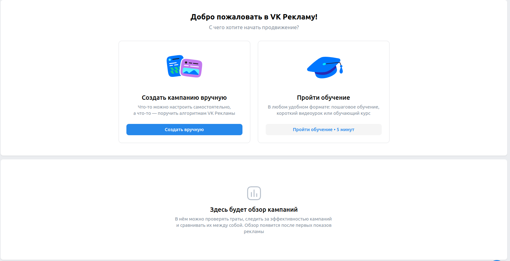
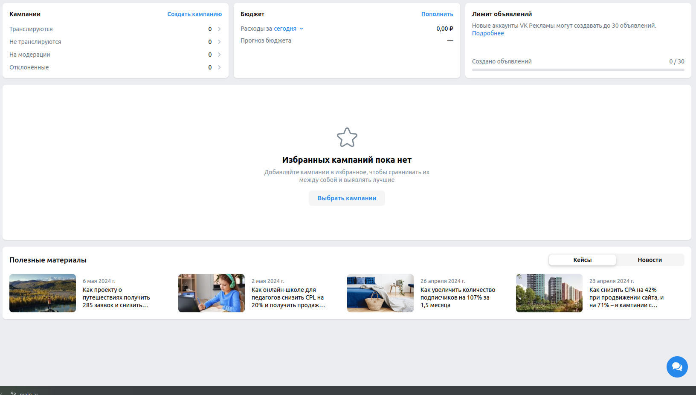

# Домашнее задание 3

## Справка
https://ads.vk.com/help

- Справка. Поиск. Ввод "авторизация" находит результаты.
- Справка. Поиск. Ввод "реклама" находит результаты.
- Справка. Поиск. Ввод "asdfasdf" не находит результаты.
- Справка. Переход на категорию "авторизация" при нажатии на нее.
  - Справка. Категория "авторизация". Переход на первую статью при нажатии на нее.
- Справка. Переход на категорию "как настроить рекламу" при нажатии на нее.
  - Справка. Категория "как настроить рекламу". Переход на первую статью при нажатии на нее. 

## Обзор

**Для нового пользователя**

Подготовка:
- Необходимо авторизоваться за нового пользователя.

- Обзор. Всплывающее окно обучения при нажатии на "Пройти обучение"
- Обзор. Переход на создание компании при нажатии на "Создать вручную"

**Для пользователя, создававшего уже кампанию**

Подготовка:
- Необходимо авторизоваться.
- Необходимо предварительно создать 6 Кампаний с названием, начинающимся на "Кампания".

- Обзор. Кампании. Переход на создание кампании https://ads.vk.com/hq/new_create/ad_plan при нажатии на 
"Создать кампанию".
- Обзор. Бюджет. Смена времени расходов, при нажатии на "сегодня" и выборе в всплывающем окне "вчера".
- Обзор. Бюджет. Всплывающая форма пополнения при нажатии "Пополнить".
- Обзор. Лимит объявлений. Переход в раздел справки https://ads.vk.com/help/articles/ad_limits при нажатии "Подробнее"
- Обзор. Избранные кампании. При нажатии "Выбрать кампании" и поиске "asdf" выводится "ничего не нашлось"
- Обзор. Избранные кампании. При нажатии "Выбрать кампании" и поиске "Кампания" выводится созданная на этапе подготовки
кампания.
- Обзор. Избранные кампании. При нажатии "Выбрать кампании" и попытке выбрать 6 кампаний при наведении на шестую
подсвечивается ошибка "Выбрано максимальное количество кампаний".
- Обзор. Избранные кампании. При нажатии "Выбрать кампании", выборе кампании и последующем нажатии "Сбросить" галочки
сбрасываются.
- Обзор. Избранные кампании. При нажатии "Выбрать кампании", выборе кампании и последующем нажатии "Сохранить" 
открывается основное окно.
- Обзор. Настройки графика. При нажатии на настройки графики и выборе другой настройки график перерисовывается.
- Обзор. Настройки графика. При нажатии на даты и выборе другого диапазона график перерисовывается.
- Обзор. Полезные материалы. При переключении в свитче "Кейсы" и "Новости" меняются полезные материалы.
