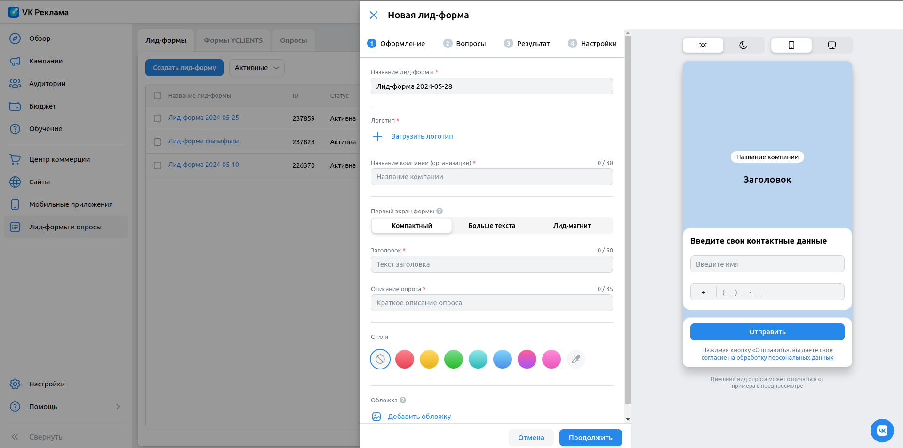
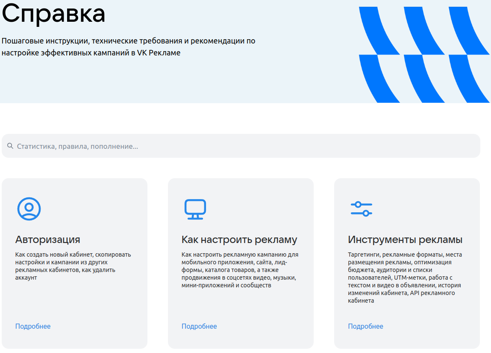

# Домашнее задание 3

## Лид-формы
Для всех путей вводим уникальные значения в поля, проверяем изменение оформления в окне предварительного просмотра.
После завершения создания проверяем необходимое название в списке, нажимаем редактировать и еще раз проверяем отображение.
В конце удаляем лид-форму.

### Создание лид-формы
Для первой проверки опишем все поля для последующих, только уникальные.
- Создание лид-формы. Оформление. Создаем с параметрами:
  - Уникальное название "Лид-форма" + случайные данные.
  - Предварительно загруженное фото для логотипа.
  - Уникальное название "ООО" + случайные данные.
  - Первый экран формы "Компактный". 
  - Стиль первый в списке градиентов (красноватый).
  - Уникальный заголовок "Заголовок" + случайные данные.
  - Уникальное описание "Описание" + случайные данные.
  - Предварительно загруженное фото для обложки.
- Создание лид-формы. Вопросы. С параметрами:
  - Контактная информация "Имя", "Номер телефона", "Страна", "Город".
  - Уникальный вопрос "Вопрос" + случайные данные.
  - Тип вопроса "Выбор одного ответа".
  - 3 уникальных ответа "ответ" + случайные данные. 
  - Стандартный вариант ответа "Другое (свой вариант)"
- Создание лид-формы. Результат. С параметрами: 
  - Уникальный заголовок "Заголовок" + случайные данные.
  - Уникальное описание "Описание" + случайные данные.
  - Добавить поле "Ссылка на сайт" с значением "https://goods-galaxy.ru".
- Создание лид-формы. Настройки. С параметрами:
  - Уникальное фио "ФИО" + случайные данные.
  - Уникальный адрес регистрации "Адрес" + случайные данные.
  - Уникальный email "email" + случайные данные + "@mail.ru".

Вторая проверка:
- Создание лид-формы. Оформление. Создаем с параметрами:
  - Первый экран формы "Больше текста".
  - Стиль второй в списке градиентов (желтоватый).
  - Уникальное длинное описание "Описание" + случайные данные.
- Создание лид-формы. Вопросы. С параметрами:
  - Контактная информация только "Электронная почта", "Возраст", "День рождения"
(удаляем стандартные "имя" и "номер телефона")
  - Уникальный вопрос "Вопрос" + случайные данные.
  - Тип вопроса "Выбор нескольких ответов".
  - 2 уникальных ответа "ответ" + случайные данные.
  - Стандартный вариант ответа "Ничего из перечисленного"
- Создание лид-формы. Результат. С параметрами:
  - Добавить поле "Телефон для заказа" с значением "+7980" + случайные данные.
- Создание лид-формы. Настройки. С параметрами:
  - Уникальный Инн "123" + случайные данные.

Третья проверка:
- Создание лид-формы. Оформление. Создаем с параметрами:
  - Первый экран формы "Лид-магнит".
  - Тип вознаграждения "Скидка".
  - Размер скидки 500 ₽
  - Стиль третий в списке градиентов (зеленоватый).
- Создание лид-формы. Вопросы. С параметрами:
  - Два вопроса типа "ответ в произвольной форме" с уникальным значением "Вопрос" + случайные данные.
  - 2 уникальных ответа "ответ" + случайные данные.
- Создание лид-формы. Результат. С параметрами:
  - Добавить поле "Добавить промокод" с значением "промо" + случайные данные.

Негативные проверки:
- Создание лид-формы. Оформление.
  - Ошибка "Обязательное поле" у "Логотип", "Название компании", "Заголовок", "Описание опроса" при попытке "далее" без 
их заполнения.
  - Ошибка "Превышена максимальная длинна поля" при вводе в заголовок 51 символа.
- Создание лид-формы. Вопросы.
  - Ошибка "Вопрос должен быть не пустым и содержать минимум 2 ответа" при попытке "далее" без их заполнения.
- Создание лид-формы. Результат.
  - Ошибка "Обязательное поле" у "Заголовок", при попытке "далее" после удаления заголовка.
- Создание лид-формы. Настройки.
  - Ошибка "Обязательное поле" у "ФИО", "Адрес регистрации по месту жительства" при попытке "далее" без из заполнения.
  - Ошибка "Некорректный email" при вводе некорректного email Пр: asdf@ru.

## Справка
https://ads.vk.com/help

- Справка. Отображение. В верстке есть:
  - заголовок "Справка"
  - поисковой инпут
  - блок карточек категорий.
- Справка. Поиск. Ввод "авторизация" находит результаты: "Создание нового кабинета", "API VK Рекламы".
- Справка. Поиск. Ввод "реклама" находит результаты: "Запуск товарной рекламы для сайтов и мобильных приложений",
"Продвижение сообществ", "Добавление нового приложения".
- Справка. Поиск. Ввод "статистика" находит результаты: "Дашборд", "Агенствам: статистика по клиентам",
"Статистика из приложений для веб-кампаний".
- Справка. Поиск. Ввод "сайт" находит результаты: "Запуск товарной рекламы для сайтов и мобильных приложений",
"Запуск рекламы сайта", "Блокировка рекламы".
- Справка. Поиск. Ввод "таргетинг" находит результаты: "Динамический ретаргетинг на базе мобильных событий",
"Динамический ретаргетинг на базе веб-событий", "Таргетинги".
- Справка. Поиск. Ввод "asdfasdf" не находит результаты.
- Справка. Категория "авторизация". Отображаются: заголовок "Авторизация", статьи: "Создание нового кабинета, авторизация"
"Обзор кабинета", "Агентствам: регистрация и импорт кабинета агентств", сайдбар с поиском и категориями.
- Справка. Категория "как настроить рекламу". Отображаются: заголовок "Как настроить рекламу",
  статьи: "Продвижение видео и трансляций", "Продвижение музыки","Продвижение мини-приложений 
(VK Mini Apps и игры ВКонтакте)", сайдбар с поиском и категориями.

## Бюджет
https://ads.vk.com/hq/budget/transactions

- Бюджет. На странице бюджета отображаются: сообщение "Транзакций пока нет", кнопка "Пополнить счет"
- Бюджет. Окно пополнения счета. В окне пополнения счета отображаются: заголовок "Пополнение счёта",
  поля "Cумма к оплате", "Сумма, поступающая на ваш счёт (НДС — 20%)", кнопка "Пополнить счёт"
- Бюджет. При вводе значения 600 руб в полее "Сумма к оплате" после нажатия на "Пополнить счёт" отображается надпись
  600 ₽, "Пополнение рекламного счета", кнопки "Оплата картой", "СБП", "Другие способы оплаты", "Оплатить 600 ₽".

- Бюджет. При вводе значения 600 руб в поле "Сумма к оплате" автоматически заполняется поле "Сумма,
поступающая на ваш счёт (НДС — 20%)" и составляет 500 руб. 
("Сумма, поступающая на ваш счёт (НДС — 20%)" = 5/6 * "Сумма к оплате")
- Бюджет. При вводе значения 500 руб в поле "Сумма, поступающая на ваш счёт (НДС — 20%)" автоматически заполняется поле
  "Сумма к оплате" и составляет 600 руб. ("Сумма к оплате" = 6/5 * "Сумма, поступающая на ваш счёт (НДС — 20%)")
- Бюджет. Ошибка "Минимальная сумма 600,00 ₽" при вводе значения меньшего 600 в поле "Сумма к оплате"
- Бюджет. Ошибка "Минимальная сумма 600,00 ₽" при вводе значения меньшего 500 в поле "Сумма, поступающая на ваш счёт
  (НДС — 20%)"
- Бюджет. При наведении на значок вопроса "?" возле полей "Сумма к оплате" или "Сумма, поступающая на ваш счёт
  (НДС — 20%)"
  всплывает окно со ссылкой на справку по минимальному платежу и НДС https://ads.vk.com/help/articles/billing#min.

  

- Бюджет. Ошибка "уменьшите сумму" при вводе значения больше 200000 в поле "Сумма к оплате"
- Бюджет. Ошибка "уменьшите сумму" при вводе значения больше 166666,67 в поле "Сумма, поступающая на ваш счёт
  (НДС — 20%)"
- Бюджет. В поле "Сумма к оплате" невозможно ввести символы, помимо цифр и запятой,
  причем если попытаться ввести точку, то введется запятая.
- Бюджет. В поле "Сумма, поступающая на ваш счёт (НДС — 20%)" невозможно ввести символы, помимо цифр и запятой,
  причем если попытаться ввести точку, то введется запятая.

## Обучение
https://ads.vk.com/hq/overview

- Обучение. Всплывающее окно обучения при нажатии на "Обучение". В нем отображаются:
  - заголовок "С чего начнем обучение?"
  - кнопка "Попробовать позже"
  - кнопка крестик для закрытия
  - кнопки "Сообщество ВКонтакте", "Сайт", "Каталог товаров", "VK Mini Apps".
- Обучение. Всплывающее окно обучения. При переходе на "Сайт" отображаются:
  - заголовок "Как хотите учится?"
  - кнопка "Настроить кампанию с подсказками"
  - кнопка "Смотреть видеоурок от экспертов VK"
  - кнопка "Смотреть курс на обучающей платформе"
- Обучение "Настроить кампанию с подсказками". Тестируем **полный маршрут** создания кампании на сайт (тут упоминаются 
проверки по уникальным типам, а не все):
  - Обучение. "Настроить кампанию с подсказками". При нажатии на целевую (обведенную) кнопку переход к следующим
    tooltip-ам. (пр: "Создать" при старте кампании)
  - Обучение. "Настроить кампанию с подсказками". При нажатии кнопки "Далее" переход к следующим tooltip-ам (пр:
"Выбор объекта и цели рекламы").
  - Обучение. "Настроить кампанию с подсказками". На tooltip-ах, требующих ввода данных (пр: "Рекламируемый сайт"),
  не активная кнопка далее, до ввода соответствующего требованиям значения.
  - Обучение. "Настроить кампанию с подсказками". На tooltip-ах, с кнопкой "Назад" (пр: "Бюджет") переход на предыдущий
    tooltip при нажатии.
  - Обучение. "Настроить кампанию с подсказками". При нажатии на крестик закрытия, потом "отмена" возврат к обучению.

## Обзор

https://ads.vk.com/hq/overview

**Для нового пользователя**

Подготовка:
- Необходимо авторизоваться за нового пользователя.

- Обзор. Отображение. В верстке есть приветственные карточки с кнопками: "Создать кампанию вручную", "пройти обучение".

**Для пользователя, создававшего уже кампанию**

Подготовка:
- Необходимо авторизоваться.
- Необходимо предварительно создать кампанию с названием, начинающимся на "Кампания".

- Обзор. Отображение. В верстке есть:
  - виджеты "Кампании", "Бюджет", "Лимит объявлений", "Избранные кампании"
  - кнопка "Создать кампанию" в виджете "Кампании".
  - кнопка "Пополнить" в виджете "Бюджет".
  - блок с действиями над графиком(смена даты, и типа)
  - блок с выбором избранных кампаний.
- Обзор. Избранные кампании. При нажатии "Выбрать кампании" и поиске "Кампания" выводится созданная на этапе подготовки
  кампания.
- Обзор. Избранные кампании. При нажатии "Выбрать кампании" и поиске "asdf" выводится "ничего не нашлось"

## Навигация между разделами
https://ads.vk.com/hq/overview

### Сайдбар
- Навигация. Сайдбар. Отображаются кнопки: "Обзор", "Кампании", "Аудитории", "Бюджет", "Обучение",
  "Центр коммерции", "Сайты", "Мобильные приложения", "Лид-формы", "Настройки", "Помощь"

### Навбар
- Навигация. Навбар. В навбаре отображаются: иконка "VK реклама", иконка кошелька (пополнение счета), иконка
колокольчика уведомлений, аватар пользователя.
